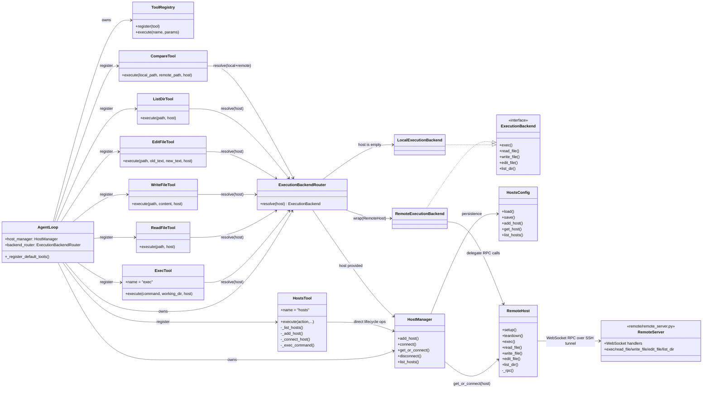
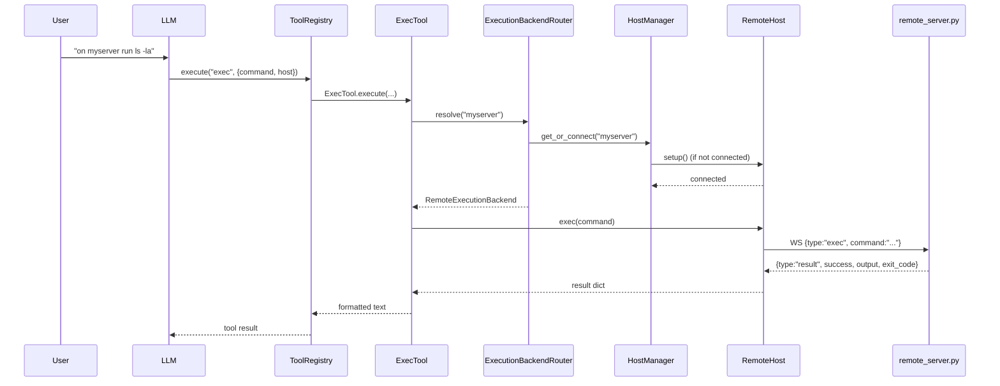
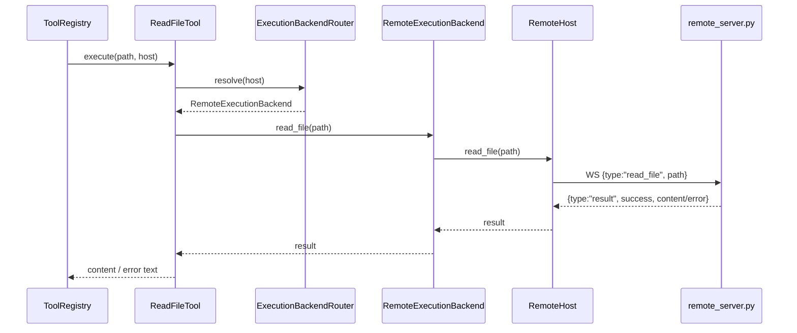
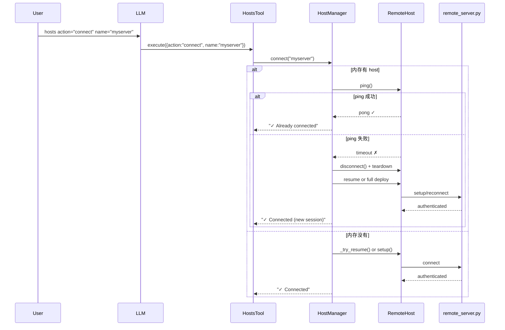
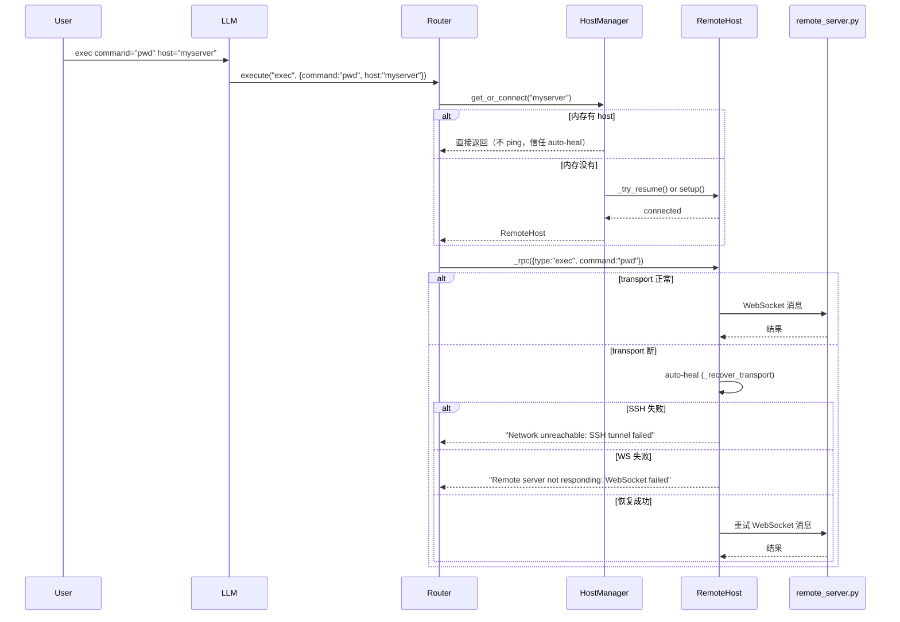
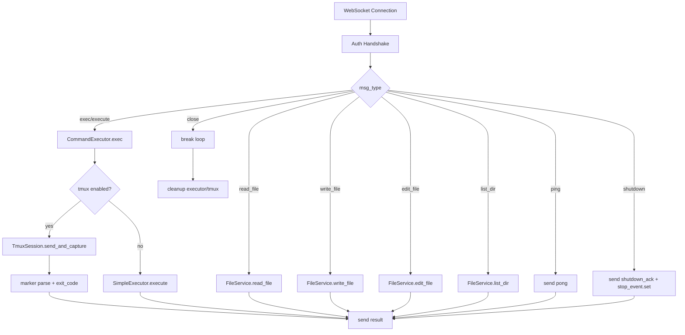
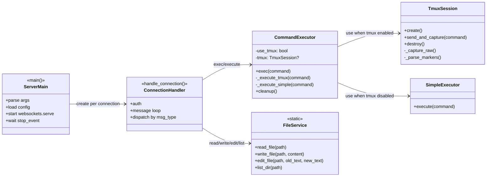
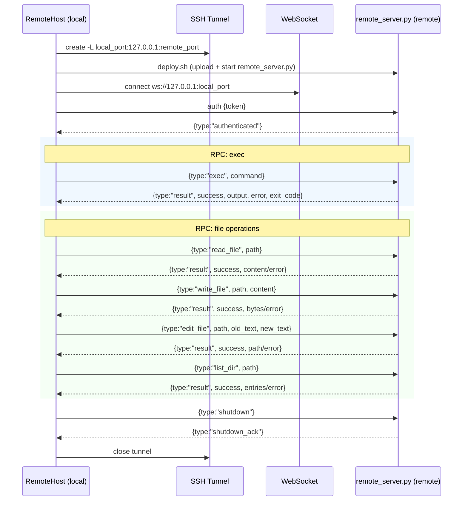

# Host / Remote 架构关系图（Mermaid）

> 目标：帮助快速理解 `HostManager`、`HostsTool`、`ExecTool`、文件类工具、Backend Router、Remote 运行时之间的关系与调用路径。

## 1) 静态关系（类/组件依赖）

---

## 2) 动态流程 A：`exec command="..." host="myserver"`

---

## 3) 动态流程 B：`read_file path="..." host="myserver"`

---

## 4) `hosts` 工具与其他工具的职责边界

- `HostsTool`：**主机生命周期管理入口**（add/connect/disconnect/status/list/exec）。
- `ExecTool` / `ReadFileTool` / `WriteFileTool` / `EditFileTool` / `ListDirTool` / `CompareTool`：**业务工具**，通过 `ExecutionBackendRouter` 统一选择本地或远程后端。
- `HostManager`：**连接生命周期**（连接池、建立/断开连接），不做业务拼装。
- `RemoteHost` + `remote_server.py`：**远程 RPC 通道**与远端执行实现。

---

## 5) 一句话心智模型

- `hosts` 负责"**我要连哪台机器**"。
- `backend_router` 负责"**这次操作走本地还是远程**"。
- 具体工具负责"**我要做什么操作**"（exec/read/write/edit/list/compare）。

---

## 6) 动态流程 C：连接管理 — `connect()` vs `get_or_connect()`

### connect()：用户主动连接（ping 验证）

### get_or_connect()：隐式连接（exec/router，无 ping）

> **关键区别**：`connect()` 主动 ping 验证 → 确保返回可用连接。`get_or_connect()` 不 ping → 信任 `_rpc()` auto-heal 处理传输问题。exec 不需要先 connect。

---

## 7) `remote_server.py` 内部结构图

要点：
- `exec` 路径走 `CommandExecutor`，并在 tmux 模式下通过 marker 精确提取输出。
- 文件操作走 `FileService`，是结构化 RPC，不再依赖 shell 拼接。
- `shutdown` 会触发 `stop_event`，让服务端优雅退出。

---

## 8) `remote_server.py` 内部类关系图（更细粒度）

### 类协作要点

- `CommandExecutor` 是命令执行门面：
  - tmux 开启 → 委托 `TmuxSession`（marker 捕获 + exit code）
  - tmux 关闭 → 委托 `SimpleExecutor`
- `FileService` 是文件 RPC 处理器（纯静态方法），与 tmux 无关。
- `handle_connection()` 是协议路由层：认证后按 `msg_type` 分发给 `CommandExecutor` 或 `FileService`。
- `main()` 负责服务生命周期（启动、信号、stop_event）。

---

## 9) `RemoteHost` ↔ `remote_server.py` 协议交互图

要点：
- `RemoteHost._rpc()` 是所有远程操作的统一入口（exec + 文件 RPC）。
- `remote_server.py` 负责协议分发，`RemoteHost` 负责连接生命周期与调用封装。
- `request_id` 用于幂等去重：同一个请求重试不会重复执行副作用命令。

---

## 10) 自动自愈与幂等策略（当前实现）

- 自动自愈：
  - 当 RPC 遇到传输层错误（SSH/WS 中断）时，`RemoteHost` 会尝试 **transport-only recovery**：
    1. 关闭旧 websocket/tunnel 句柄
    2. 重新建立 SSH tunnel
    3. 重新连接 WebSocket
    4. 重新认证
  - **不会**隐式 redeploy / 重建 session（避免用户 surprise）。

- 幂等去重：
  - 客户端每个 RPC 带 `request_id`。
  - 服务端维护 request cache + in-flight 表：
    - 已完成同 ID：直接返回缓存结果
    - 执行中同 ID：等待同一个 future 结果
    - 同 ID 但 payload 不同：返回错误

- 效果：
  - 网络瞬断时，用户再次发命令通常可无感恢复。
  - 断线重试同一请求不会导致重复写文件/重复执行副作用命令。

---

## 11) 从架构图跳转到"真实 LLM payload"样例

为方便 PR reviewer 将"架构设计"与"LLM 实际看到的输入"对应起来，本分支提供了真实运行时捕获（脱敏）样例：

- `docs/node-remote/PROVIDER_CHAT_PAYLOAD_SAMPLE.json`

建议阅读顺序：
1. 先看本文件的类图/时序图（理解组件关系与调用路径）
2. 再看 `PROVIDER_CHAT_PAYLOAD_SAMPLE.json`（验证 `messages + tools` 的真实形态）

重点关注样例中的：
- `tools[].function.name/description/parameters`（尤其 `host` 参数）
- `hosts` 工具动作 schema（生命周期管理）
- `exec/read_file/write_file/edit_file/list_dir` 在同一工具层统一支持远程
